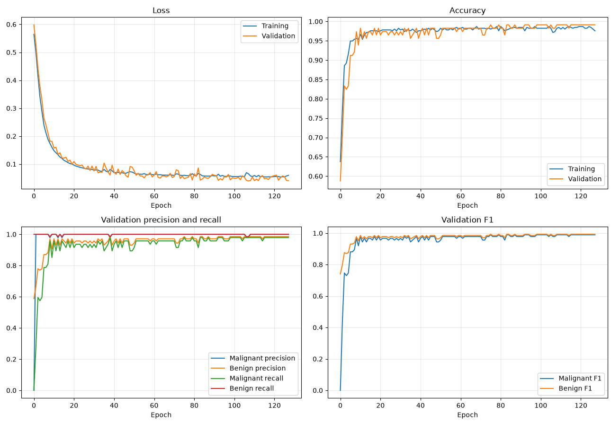

# 42_multilayer-perceptron

A neural network built from scratch with NumPy to classify breast tumors as
malignant (`M`) or benign (`B`). The project implements forward propagation,
backpropagation, mini-batch training, the Adam optimizer, early stopping, model
serialization, and prediction without using a machine-learning framework.

The bundled `data.csv` is the Wisconsin Diagnostic Breast Cancer dataset. Each
sample contains 30 numeric features computed from a digitized image of a breast
mass.

The main focus of this project is the mathematical side of neural networks. The
core operations: activation functions, forward propagation, loss calculation,
backpropagation, gradient computation, and Adam parameter updates. They're all implemented
directly to make the underlying mathematics explicit and easier to understand.

## How it works

The network consists of:

- 30 input features;
- one or more configurable fully connected hidden layers with sigmoid
  activations;
- a two-neuron output layer with softmax probabilities for `M` and `B`.

Training minimizes binary cross-entropy through backpropagation and updates the
parameters with Adam. At the end of each epoch, the program reports training and
validation loss. It also tracks accuracy, precision, recall, and per-class F1,
saves the parameters from the epoch with the lowest validation loss, and shows a
summary plot.

## Requirements

- Python 3.11 or newer (required by the pinned NumPy and pandas versions)
- The Python packages pinned in `requirements.txt`

Create an isolated environment and install the dependencies:

```bash
python3 -m venv .venv
source .venv/bin/activate
python3 -m pip install -r requirements.txt
```

## Usage

All commands below should be run from the repository root because the scripts
read and write files relative to the current directory.

### 1. Prepare the data

```bash
python3 process_dataset.py
```

This command:

1. reads `data.csv`;
2. removes the sample ID;
4. applies min-max normalization to dataset
3. randomly splits the rows into 80% training and 20% validation sets;
5. creates `training_dataset.csv` and `validation_dataset.csv`.

The split is random and currently has no fixed seed, so rerunning this command
will produce different datasets.

### 2. Train the model

```bash
python3 training.py
```

To customize the training configuration, pass the desired options on the command
line:

```bash
python3 training.py \
  --epochs 100 \
  --layers 16 8 \
  --batch_size 16 \
  --learning_rate 0.001 \
  --patience 20
```

Available options:

| Option | Default | Description |
| --- | --- | --- |
| `--epochs` | `500` | Maximum number of training epochs |
| `--dataset` | `training_dataset.csv validation_dataset.csv` | Training and validation CSV paths, in that order |
| `--layers` | `10 8` | Neuron count for each hidden layer |
| `--batch_size` | `16` | Number of samples per parameter update |
| `--learning_rate` | `0.001` | Adam learning rate |
| `--patience` | `50` | Validation-loss window used for early stopping |

For example, use alternative prepared datasets with:

```bash
python3 training.py --dataset train.csv validation.csv
```

Training writes the best model to `weights_bias.json`. When training finishes,
it prints the macro validation F1 score and opens plots for loss, accuracy,
precision/recall, and F1.

### Training statistics

The model achieved a macro validation F1 score of **0.97** in the example run
shown below. Because the data split and parameter initialization are random,
the exact score may vary between runs.

The following plot shows an example run's training and validation loss,
accuracy, per-class precision and recall, and per-class validation F1 score:



### 3. Make predictions

```bash
python3 prediction.py validation_dataset.csv
```

Prediction loads `weights_bias.json` from the current directory and creates
`predictions_result.csv`. The output contains one predicted label (`M` or `B`)
per line and has no header. The input may include a `diagnosis` column; it is
ignored during inference. Otherwise, it must contain the same 30 normalized
feature columns, in the same order used for training.

## Dataset format

The raw input expected by `process_dataset.py` has no header and contains these
fields:

```text
id, diagnosis, 30 numeric features
```

The generated training and validation files omit `id` and retain `diagnosis` as
the target column. The feature groups describe the mean, standard error, and
worst value of radius, texture, perimeter, area, smoothness, compactness,
concavity, concave points, symmetry, and fractal dimension.

## Generated files

| File | Created by | Purpose |
| --- | --- | --- |
| `training_dataset.csv` | `process_dataset.py` | Normalized training split |
| `validation_dataset.csv` | `process_dataset.py` | Normalized validation split |
| `weights_bias.json` | `training.py` | Weights and biases from the best validation epoch |
| `predictions_result.csv` | `prediction.py` | Predicted class labels |

## Project structure

| File | Responsibility |
| --- | --- |
| `process_dataset.py` | Loads, splits, and normalizes the raw dataset |
| `training.py` | Forward pass, backpropagation, Adam updates, and training loop |
| `prediction.py` | Loads a saved model and performs inference |
| `Layer.py` | Stores layer parameters, activations, gradients, and Adam state |
| `TrainingData.py` | Holds datasets, layers, metrics, and early-stopping state |
| `stats.py` | Computes and plots evaluation metrics |
| `arguments.py` | Defines training command-line options |
| `utils.py` | Sigmoid, softmax, and model serialization helpers |

## Notes

- Static type checking was performed with [mypy](https://www.mypy-lang.org/).
- Model parameters and predictions are overwritten on each new run.
- Data splitting and weight initialization are unseeded, so results vary between
  runs.

## Sources

- [Neural-network mathematics (YouTube)](https://www.youtube.com/watch?v=tIeHLnjs5U8&t=38s)
- [Multilayer perceptron explanation (YouTube)](https://www.youtube.com/watch?v=VCGlYxGJZ04)
- [The role of softmax in neural networks](https://www.geeksforgeeks.org/deep-learning/the-role-of-softmax-in-neural-networks-detailed-explanation-and-applications/)
- [Multi-layer perceptron learning in TensorFlow](https://www.geeksforgeeks.org/deep-learning/multi-layer-perceptron-learning-in-tensorflow/)
- [Wisconsin Diagnostic Breast Cancer](https://archive.ics.uci.edu/ml/machine-learning-databases/breast-cancer-wisconsin/wdbc.names)
